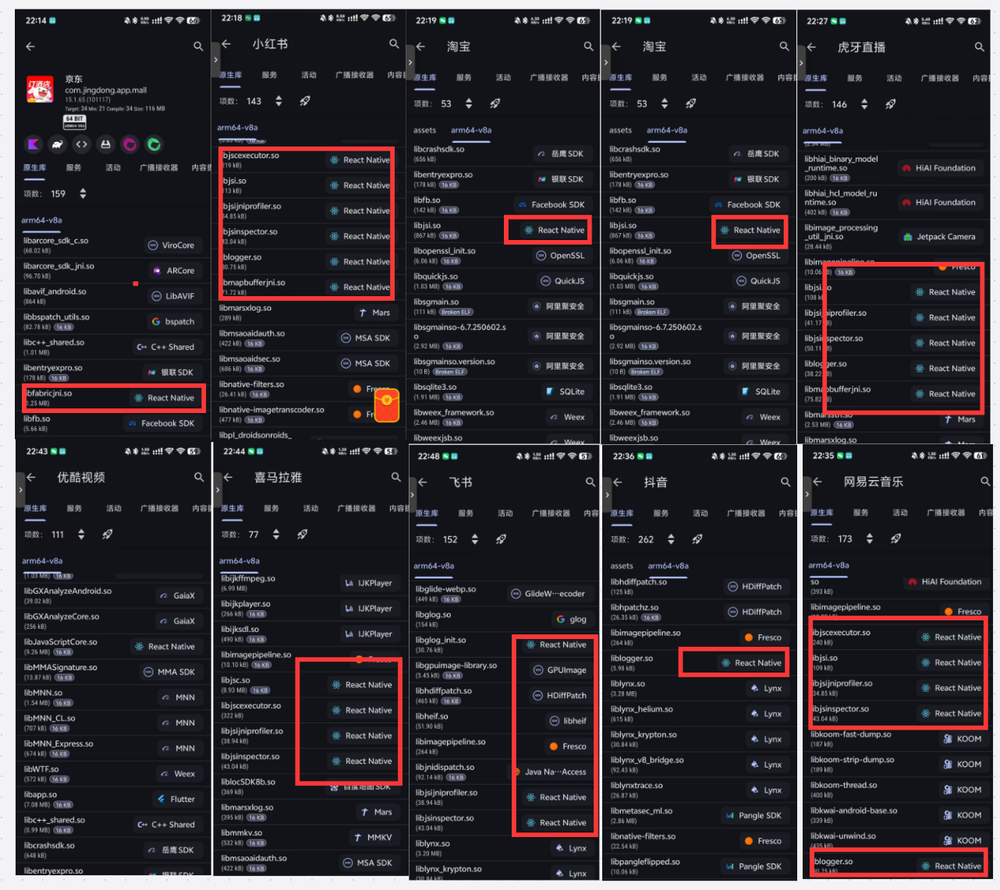

# React Native 简介

学习React Native之前，需要先学习`React`。

[React视频教程](https://www.bilibili.com/video/BV1mcpPeMETt/?spm_id_from=333.1387.homepage.video_card.click)

欢迎收看2025年最新的React Native教程，目前对应的版本是`0.80.1`，那我为什么要使用React Native呢？

因为如果要单独开发iOS你需要学习`Objective-C`或者`Swift`，如果单独开发Android你需要学习`Java`或者`Kotlin`，学习成本太高。

而使用React Native你只需要学习`JavaScript`和`React`，就可以开发出`iOS`和`Android`应用，当然也有一些其他更优秀的跨平台框架，比如`flutter(如果你愿意学习dart的话)`，`uniapp(如果你愿意牺牲一些性能的话)`。

### 那么有谁在用呢🤔?

根据`libchecker`工具的统计，目前所统计的使用了React Native的app有：

:::warning
该名单包含(全部使用React Native开发，原生混编，以及部分页面使用React Native开发)
:::

**京东** / **小红书** / **淘宝** / **虎牙直播** / **优酷视频** / **喜马拉雅** / **飞书** / **抖音** / **网易云音乐**

### 支持的平台😊

- [Android 官方维护](https://reactnative.dev/docs/set-up-your-environment?os=windows&platform=android)
- [iOS 官方维护](https://reactnative.dev/docs/set-up-your-environment?os=macos&platform=ios)
- [Web 官方维护](https://reactnative.dev/docs/getting-started)
- [TV(Apple TV, Android TV) 社区维护](https://github.com/react-native-tvos/react-native-tvos/wiki)
- [Windows 微软维护](https://microsoft.github.io/react-native-windows/)
- [MacOS 微软维护(刷波格局)](https://microsoft.github.io/react-native-macos/)
- [小程序 已经不维护了(慎用)](https://areslabs.github.io/alita/)
