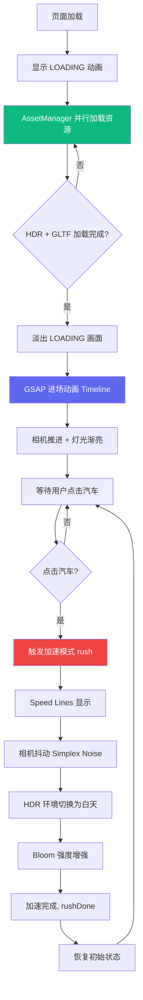

# 项目实战二：汽车展示网站（完整复刻版）

> 完整复刻小米 SU7 官网特效，参考 [su7-replica](https://github.com/alphardex/su7-replica)

## 在线演示

<iframe
  src="https://cdn.jsdelivr.net/gh/raopan2021/blog@main/docs/public/three-projects/car-showcase/index.html"
  width="100%"
  height="560px"
  frameborder="0"
  style="border-radius:8px; background:#000;"
  allow="autoplay; xr-spatial-tracking"
  allowfullscreen
></iframe>

<p style="text-align:center; color:rgba(255,255,255,0.4); font-size:12px; margin-top:8px;">
  🚗 等待 LOADING 动画完成 → 进场 → 点击汽车触发加速 &nbsp;|&nbsp; Speed Lines · 相机抖动 · HDR 环境 · Bloom 发光
</p>

## 项目概述

本项目完整复刻了小米 SU7 官网的 3D 展示特效，包含以下功能：

| 功能 | 实现方式 |
|------|---------|
| LOADING 动画 | CSS 动画 + JS 过渡 |
| 进场动画 | GSAP timeline 编排 |
| 点击加速 | 射线检测 + GSAP 时间线 |
| Speed Lines | GLTF 模型 |
| 相机抖动 | Simplex Noise 算法 |
| HDR 环境切换 | 两个 HDR 动态混合 |
| Bloom 发光 | UnrealBloomPass 后处理 |
| 背景音乐 | Howler.js |

## 制作阶段

本项目分为 **11 个阶段**，每个阶段独立成篇：

| 阶段 | 名称 | 内容 |
|------|------|------|
| Stage 1 | [[项目初始化与结构\|Stage1-项目初始化]] | 目录结构、依赖安装、Vite 配置 |
| Stage 2 | [[入口页面与加载动画\|Stage2-入口页面与加载动画]] | HTML 结构、CSS 动画原理 |
| Stage 3 | [[Three.js 基础场景\|Stage3-ThreeJS基础场景]] | 场景、相机、渲染器、坐标系统 |
| Stage 4 | [[资源加载系统\|Stage4-资源加载系统]] | AssetManager、HDR、纹理预处理 |
| Stage 5 | [[后处理 Bloom 发光\|Stage5-后处理Bloom发光]] | EffectComposer、Bloom 原理、emissive 材质 |
| Stage 6 | [[动态环境贴图\|Stage6-动态环境贴图]] | FBO、两个 HDR 混合、着色器 |
| Stage 7 | [[汽车与展示厅模型\|Stage7-汽车与展示厅模型]] | GLTF 加载、材质配置、贴图详解 |
| Stage 8 | [[GSAP 动画系统\|Stage8-GSAP动画系统]] | Timeline、缓动函数、进场动画 |
| Stage 9 | [[加速模式\|Stage9-加速模式]] | rush/rushDone、完整时间线 |
| Stage 10 | [[相机抖动\|Stage10-相机抖动]] | Simplex Noise、Lerp 平滑 |
| Stage 11 | [[交互与完整流程\|Stage11-交互与完整流程]] | 射线检测、背景音乐、初始化流程 |

## 项目架构

以下流程图展示了汽车展示网站的完整执行流程：



## 项目结构

```
car-showcase/
├── index.html              # 入口 HTML（LOADING 动画 CSS）
├── package.json           # 依赖：three.js, gsap, howler.js
├── vite.config.js         # 构建配置（内联 public 资源）
├── public/                # 外部资源（随构建复制）
│   ├── audio/bgm.mp3     # 背景音乐（循环播放）
│   ├── mesh/
│   │   ├── sm_car.gltf         # 汽车模型（含多部件）
│   │   ├── sm_startroom.gltf   # 展示厅模型
│   │   └── sm_speedup.gltf     # 速度线特效模型
│   └── texture/
│       ├── t_env_night.hdr     # 夜间 HDR 环境贴图
│       ├── t_env_light.hdr      # 白天 HDR 环境贴图
│       ├── t_car_body_AO.jpg    # 车身 AO 贴图
│       └── t_floor_*.webp      # 地面法线/粗糙度贴图
└── src/
    └── main.js           # 主入口（905 行，含全部特效逻辑）
```

## 特效功能详解

### 🚀 LOADING 动画
- 纯 CSS 实现：`LOADING` 文字逐字跳动动画
- JS 监听资源加载进度，`AssetManager` 统计已加载/总数
- 全部加载完成后，`.loader-screen` 元素添加 `hollow` 类触发淡出

### 🎬 进场动画（GSAP Timeline）
```js
// 伪代码：进场 Timeline 编排
const tl = gsap.timeline({ delay: 0.5 })

// 相机从远处推进到汽车面前
tl.to(camera.position, { z: -4.5, duration: 3, ease: 'power2.inOut' })

// 灯光强度从 0 渐亮到 1
tl.to(params, { lightIntensity: 1, duration: 3 }, '-=3')

// 环境贴图强度渐入
tl.to(params, { envIntensity: 1, duration: 2 }, '-=2')

// 解锁交互
tl.add(() => { params.disableInteract = false })
```

### ⚡ 点击加速模式
1. 射线检测点击的物体是否为汽车
2. `isRushing = true`，触发 `rush()` 函数
3. GSAP timeline 控制：Speed Lines 显示 → 相机抖动 → HDR 切换 → Bloom 增强
4. `speed` 参数从 0 插值到 10，模拟加速感

### 🎨 HDR 环境动态混合
```js
// 两个 HDR 通过 weight 权重混合
// params.envWeight: 0 = 夜间 HDR, 1 = 白天 HDR
scene.environment = lerp(hdrNight, hdrLight, params.envWeight)
```

### ✨ Bloom 发光
```js
// emissive 材质亮度超过 threshold 即产生光晕
const bloomPass = new UnrealBloomPass(
  new THREE.Vector2(w, h),  // 分辨率
  1.0,                       // 强度
  0.4,                       // 半径
  0.85                       // threshold（越低发光范围越大）
)
```

### 📷 相机抖动（Simplex Noise）
```js
// Simplex Noise 生成的平滑随机值替代 Math.random()
// 避免纯随机造成的画面"撕裂感"
const noiseX = simplex.noise2D(time * 2, 0) * intensity
const noiseY = simplex.noise2D(0, time * 2) * intensity
camera.position.x = baseX + noiseX
camera.position.y = baseY + noiseY
```

## 核心代码解析

以下为 `src/main.js` 的关键代码段解析：

### ① 全局动画参数

```js
// 所有动画相关状态集中管理，GSAP 直接修改这些值
const params = {
  cameraPos: { x: 0, y: 0.8, z: -11 }, // 相机目标位置
  cameraFov: 33.4,                        // 视野角度（加速时可能调整）
  speed: 0,                               // 当前速度 0~10
  lightAlpha: 0,                          // 灯光颜色插值（0=暗色，1=亮色）
  lightIntensity: 0,                       // 灯光强度
  envWeight: 0,                           // HDR 混合权重（0=夜间，1=白天）
  reflectIntensity: 0,                    // 地面反射强度
  cameraShakeIntensity: 0,                // 相机抖动幅度
  bloomIntensity: 1,                      // Bloom 强度
  isRushing: false,                       // 是否处于加速模式
  disableInteract: true,                  // 进场时禁止点击交互
}
```

### ② 资源加载系统

```js
class AssetManager {
  constructor() {
    this.items = {}       // 存储已加载的资源
    this.total = 0        // 需要加载的资源总数
    this.loaded = 0       // 已完成加载的数量
  }

  loadGLTF(name, path) {
    this.total++
    new GLTFLoader().load(path, (gltf) => {
      this.items[name] = gltf
      this.onLoaded()
    })
  }

  // 每完成一个资源调用一次
  onLoaded() {
    this.loaded++
    const progress = this.loaded / this.total
    // 更新 LOADING 进度条 UI...
    if (this.loaded >= this.total) {
      this.readyCallbacks.forEach(cb => cb())
    }
  }
}
```

### ③ 加速模式 timeline

```js
function rush() {
  if (params.isRushing || params.disableInteract) return
  params.isRushing = true

  const tl = gsap.timeline({
    onComplete: () => {
      params.isRushing = false
      // 恢复初始状态...
    }
  })

  // Speed Lines 淡入
  tl.to(params, { speedUpOpacity: 1, duration: 0.5 })

  // 速度插值
  tl.to(params, { speed: 10, duration: 3, ease: 'power1.in' })

  // 相机抖动增强
  tl.to(params, { cameraShakeIntensity: 0.15, duration: 0.5 }, '-=3')

  // HDR 切换到白天
  tl.to(params, { envWeight: 1, duration: 2 }, '-=2.5')

  // Bloom 增强
  tl.to(params, { bloomIntensity: 3, duration: 1 }, '-=2')

  // 速度降回 0
  tl.to(params, { speed: 0, duration: 1.5, ease: 'power2.out' })
}
```

### ④ Simplex Noise 相机抖动

```js
// simplex-noise 库生成的平滑噪声
import { createNoise2D } from 'simplex-noise'
const simplex = createNoise2D()

// 每帧调用
function updateCameraShake(time) {
  const intensity = params.cameraShakeIntensity
  const noiseX = simplex(time * 1.5, 0) * intensity
  const noiseY = simplex(0, time * 1.5) * intensity

  camera.position.x = baseCameraX + noiseX
  camera.position.y = baseCameraY + noiseY
}
```

### ⑤ Bloom 后处理管线

```js
import { EffectComposer } from 'three/examples/jsm/postprocessing/EffectComposer.js'
import { RenderPass } from 'three/examples/jsm/postprocessing/RenderPass.js'
import { UnrealBloomPass } from 'three/examples/jsm/postprocessing/UnrealBloomPass.js'

// 1. 创建后处理合成器
const composer = new EffectComposer(renderer)

// 2. 基础场景渲染通道
const renderPass = new RenderPass(scene, camera)
composer.addPass(renderPass)

// 3. Bloom 发光通道
const bloomPass = new UnrealBloomPass(
  new THREE.Vector2(window.innerWidth, window.innerHeight),
  params.bloomIntensity,  // 强度
  0.4,                   // 模糊半径
  0.85                   // luminance threshold（超过此亮度的像素发光）
)
composer.addPass(bloomPass)

// 4. 每帧使用 composer.render() 替代 renderer.render()
function animate() {
  // ... 更新逻辑
  composer.render()  // 自动执行所有后处理通道
}
```

## 特效参数配置表

| 参数 | 默认值 | 加速时 | 说明 |
|------|--------|--------|------|
| `speed` | `0` | `10` | 速度值，驱动 HUD 显示 |
| `lightIntensity` | `0` | `1` | 灯光强度，进场时渐亮 |
| `envWeight` | `0` | `1` | HDR 混合比，0=夜间/1=白天 |
| `cameraShakeIntensity` | `0` | `0.15` | 相机抖动幅度 |
| `bloomIntensity` | `1` | `3` | Bloom 发光强度 |
| `reflectIntensity` | `0` | `0.8` | 地面反射强度 |
| `speedUpOpacity` | `0` | `1` | Speed Lines 透明度 |

## 常见问题排查

### Q1: LOADING 后一直黑屏
> 检查控制台是否有 GLTF/HDR 加载错误。确认 `public/mesh/` 和 `public/texture/` 文件存在且路径正确（区分大小写）。

### Q2: Bloom 发光效果不明显
> 检查材质的 `emissive` 值是否足够高（需超过 `UnrealBloomPass` 的 threshold，默认 0.85）。车身车灯 emissive 应设为 `0xffffff` 或高亮度颜色。

### Q3: 加速模式点击无响应
> `params.disableInteract = true` 在进场完成前会阻止交互。确认 GSAP timeline 的 `onComplete` 已将 `disableInteract` 设为 `false`。

### Q4: HDR 环境贴图显示异常（过曝/全黑）
> HDR 需要使用 `RGBELoader`，普通 `TextureLoader` 无法正确解析。确认使用了 `.hdr` 格式文件并调用了 `texture.mapping = THREE.EquirectangularReflectionMapping`。

### Q5: Simplex Noise 抖动效果卡顿
> 检查是否在 `animate()` 循环外创建了 noise 实例。每帧 `createNoise2D()` 调用会产生抖动，正确做法是在模块顶层创建一次复用。

## 核心技术栈

```
Three.js        3D 渲染引擎
GSAP            动画时间线编排
Simplex Noise   平滑随机算法
EffectComposer  后处理管线
WebGL           浏览器 3D 图形
```

## 关键原理速查

### Bloom 发光
- emissive 材质（车灯）亮度 > threshold → 被检测为高亮
- 模糊后叠加 → 产生光晕

### HDR 环境贴图
- HDR 存储亮度范围远超 0~255
- 用于 scene.environment = 环境反射

### GSAP Timeline
- 多个动画并行/串行编排
- `'-=2.5'` 表示相对定位（提前 2.5 秒）

### Simplex Noise
- 平滑连续的随机噪声
- 用于相机抖动而非纯随机

## 运行项目

```bash
# 安装依赖
pnpm install

# 开发模式
pnpm dev

# 构建生产
pnpm build
```

## 下载项目

> ⚠️ 汽车展示项目含外部资源（模型/HDR/音频），在线演示需配合 public 文件夹使用

<a href="/blog/three-projects/car-showcase/index.html" target="_blank">📄 在线预览汽车展示</a>

<a href="/blog/three-projects/car-showcase.zip" download>📦 下载完整项目源码（含 3D 模型 + 贴图 + 音频）</a>

## 扩展练习

### 练习 1：添加轨道控制器
在加速模式结束后允许用户自由旋转视角：

```js
import { OrbitControls } from 'three/examples/jsm/controls/OrbitControls.js'
const controls = new OrbitControls(camera, renderer.domElement)
controls.enableDamping = true
```

### 练习 2：添加参数 HUD
在 3D 场景上叠加汽车参数的浮动面板，显示当前速度、FOV 等。

### 练习 3：添加加速音效
使用 Howler.js 添加加速时的引擎声效。

---

[[返回 Three.js 首页|../index]]
