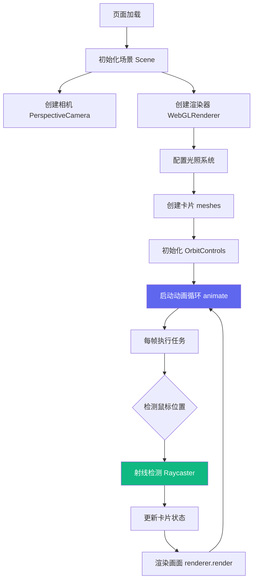

# 项目实战一：3D 卡片展示

> 一个交互式的 3D 卡片展示场景，支持鼠标悬浮倾斜、点击翻转动画

## 在线演示

<iframe
  src="/blog/three-projects/3d-card-showcase/index.html"
  width="100%"
  height="520px"
  frameborder="0"
  style="border-radius:8px; background:#1a1a2e;"
  allow="autoplay; xr-spatial-tracking"
  allowfullscreen
></iframe>

<p style="text-align:center; color:rgba(255,255,255,0.5); font-size:13px; margin-top:8px;">
  👆 点击卡片翻转 &nbsp;|&nbsp; 🖱️ 悬浮鼠标控制角度 &nbsp;|&nbsp; 拖拽空白处旋转场景
</p>

## 项目阶段

本项目分为 **10 个 Stage**，每个 Stage 独立成篇：

| 阶段 | 名称 | 内容 |
|------|------|------|
| Stage 1 | [[项目初始化\|Stage1-项目初始化]] | 目录结构、依赖安装、Vite 配置 |
| Stage 2 | [[场景相机渲染器\|Stage2-场景相机渲染器]] | Scene、Camera、Renderer 三件套 |
| Stage 3 | [[光照系统\|Stage3-光照系统]] | AmbientLight、DirectionalLight、PointLight |
| Stage 4 | [[Canvas纹理生成\|Stage4-Canvas纹理生成]] | 程序化生成卡片正反面纹理 |
| Stage 5 | [[3D卡片创建\|Stage5-3D卡片创建]] | BoxGeometry、材质数组、网格布局 |
| Stage 6 | [[鼠标交互\|Stage6-鼠标交互]] | Raycaster、归一化坐标、悬浮检测 |
| Stage 7 | [[翻转动画\|Stage7-翻转动画]] | Lerp 插值、180° 旋转、平滑过渡 |
| Stage 8 | [[动画循环\|Stage8-动画循环]] | requestAnimationFrame、正弦波浮动 |
| Stage 9 | [[响应式与性能\|Stage9-响应式与性能]] | resize 适配、高清屏、移动端 |
| Stage 10 | [[扩展练习\|Stage10-扩展练习]] | 拖拽排序、展开态、音效反馈 |

## 项目架构

以下流程图展示了整个项目的核心执行流程：



## 项目结构

```
3d-card-showcase/
├── index.html              # 入口 HTML（标题、canvas画布）
├── package.json           # 依赖：three.js ^0.170.0, vite ^5.4.0
├── vite.config.js         # 构建配置（vite-plugin-singlefile 单文件打包）
├── public/                # 公共资源（本项目无外部资源）
└── src/
    └── main.js            # 全部逻辑（约 340 行）
```

## 核心代码详解

以下为 `src/main.js` 的完整源码，逐段解析：

### ① 场景初始化

```js
// 获取 HTML 中的 canvas 元素
const canvas = document.getElementById('canvas')

// 创建场景容器
const scene = new THREE.Scene()

// 透视相机：FOV=45°, 近裁=0.1, 远裁=1000
const camera = new THREE.PerspectiveCamera(
  45,
  window.innerWidth / window.innerHeight,  // 动态适配窗口
  0.1,
  1000
)
camera.position.set(0, 0, 8)  // 相机位于 z=8, 俯视 xy 平面

// WebGL 渲染器
const renderer = new THREE.WebGLRenderer({
  canvas,
  antialias: true,   // 抗锯齿，边缘更平滑
  alpha: true,      // 透明背景（配合 CSS 渐变）
})
renderer.setSize(window.innerWidth, window.innerHeight)
renderer.setPixelRatio(Math.min(window.devicePixelRatio, 2)) // 限制高清屏像素比
renderer.shadowMap.enabled = true
renderer.shadowMap.type = THREE.PCFSoftShadowMap  // 柔和阴影
```

### ② 光照系统

```js
// 环境光：白色，强度 0.4，照亮所有面（无方向）
const ambientLight = new THREE.AmbientLight(0xffffff, 0.4)
scene.add(ambientLight)

// 方向光：主光源，位于右上前方，制造阴影
const mainLight = new THREE.DirectionalLight(0xffffff, 1.2)
mainLight.position.set(5, 5, 5)
mainLight.castShadow = true
mainLight.shadow.mapSize.set(1024, 1024)
scene.add(mainLight)

// 补光：蓝色调，强度 0.3，消除左侧阴影死区
const fillLight = new THREE.DirectionalLight(0x4488ff, 0.3)
fillLight.position.set(-5, 0, 5)
scene.add(fillLight)

// 点光源：青色，强度 0.5，在 z=3 处绕 y 轴旋转
const pointLight = new THREE.PointLight(0x00ffff, 0.5, 20)
pointLight.position.set(0, 3, 3)
scene.add(pointLight)
```

### ③ Canvas 纹理生成

```js
function createCardFrontTexture(title, subtitle, gradientStart, gradientEnd, icon) {
  const canvas = document.createElement('canvas')
  canvas.width = 512
  canvas.height = 320
  const ctx = canvas.getContext('2d')

  // 线性渐变背景
  const gradient = ctx.createLinearGradient(0, 0, canvas.width, canvas.height)
  gradient.addColorStop(0, gradientStart)
  gradient.addColorStop(1, gradientEnd)

  // 圆角矩形（使用辅助函数）
  ctx.fillStyle = gradient
  roundRect(ctx, 0, 0, canvas.width, canvas.height, 20)
  ctx.fill()

  // 居中绘制 emoji 图标
  ctx.font = '80px serif'
  ctx.textAlign = 'center'
  ctx.fillText(icon, canvas.width / 2, 120)

  // 标题 + 副标题
  ctx.font = 'bold 36px sans-serif'
  ctx.fillStyle = 'white'
  ctx.fillText(title, canvas.width / 2, 200)

  // 转换为 Three.js 纹理（自动更新，无需手动刷新）
  return new THREE.CanvasTexture(canvas)
}
```

### ④ 卡片创建逻辑

```js
function createCard(config, index) {
  const { title, subtitle, icon, front, back } = config

  // BoxGeometry: 宽2，高1.25，厚0.1（薄盒子）
  const geometry = new THREE.BoxGeometry(2, 1.25, 0.1)

  // 正面材质（带 Canvas 生成的渐变纹理）
  const frontTexture = createCardFrontTexture(title, subtitle, front[0], front[1], icon)
  const frontMaterial = new THREE.MeshStandardMaterial({
    map: frontTexture,
    roughness: 0.3,   // 较光滑，微微反光
    metalness: 0.1,
  })

  // 背面材质（深色 + 同心圆装饰 + 编号）
  const backTexture = createCardBackTexture(back)
  const backMaterial = new THREE.MeshStandardMaterial({ map: backTexture })

  // 四个侧面统一使用深灰材质
  const sideMaterial = new THREE.MeshStandardMaterial({ color: 0x222233 })

  // 材质数组索引顺序: [右, 左, 上, 下, 前, 后]
  const materials = [
    sideMaterial, sideMaterial, sideMaterial, sideMaterial,
    frontMaterial, backMaterial
  ]

  const mesh = new THREE.Mesh(geometry, materials)

  // 网格布局：3 列，索引转 (col, row)
  const cols = 3
  const row = Math.floor(index / cols)
  const col = index % cols
  mesh.position.set(
    (col - 1) * 2.5,    // 列号偏移，使整体居中
    -row * 1.8 + 0.9,   // 行号偏移（Y轴向下为负）
    0
  )

  // 存储动画状态（userData 可自由附加任意数据）
  mesh.userData = {
    isFlipped: false,
    targetRotationY: 0,
    currentRotationY: 0,
    basePositionY: mesh.position.y,
  }

  scene.add(mesh)
  cards.push(mesh)
}
```

### ⑤ 鼠标交互

```js
const raycaster = new THREE.Raycaster()
const mouse = new THREE.Vector2()

// mousemove：实时更新归一化鼠标坐标
window.addEventListener('mousemove', (event) => {
  mouse.x = (event.clientX / window.innerWidth) * 2 - 1   // → [-1, 1]
  mouse.y = -(event.clientY / window.innerHeight) * 2 + 1 // → [-1, 1]
})

// click：射线检测点击的卡片
window.addEventListener('click', () => {
  raycaster.setFromCamera(mouse, camera)
  const intersects = raycaster.intersectObjects(cards)
  if (intersects.length > 0) {
    flipCard(intersects[0].object)
  }
})

function flipCard(card) {
  card.userData.isFlipped = !card.userData.isFlipped
  // 翻转目标：Math.PI = 180°, 正面 = 0
  card.userData.targetRotationY = card.userData.isFlipped ? Math.PI : 0
}
```

### ⑥ 动画循环

```js
const clock = new THREE.Clock()

function animate() {
  requestAnimationFrame(animate)  // 浏览器 VSync 驱动，约 60fps

  const elapsed = clock.getElapsedTime()  // 总运行秒数

  cards.forEach((card, index) => {
    // Lerp 插值：每帧向目标角度靠近 10%
    card.userData.currentRotationY += (
      card.userData.targetRotationY - card.userData.currentRotationY
    ) * 0.1
    card.rotation.y = card.userData.currentRotationY

    // 悬浮效果
    if (hoveredCard === card) {
      card.rotation.x = THREE.MathUtils.lerp(card.rotation.x, mouse.y * 0.3, 0.05)
      card.rotation.y = card.userData.currentRotationY + mouse.x * 0.3
      card.position.y = THREE.MathUtils.lerp(card.position.y, card.userData.basePositionY + 0.2, 0.1)
    }

    // 正弦波浮动（每张卡片相位错开）
    card.position.y += Math.sin(elapsed * 2 + index) * 0.001
  })

  // 点光源绕 y 轴缓慢旋转 → 卡片高光区域随之移动
  pointLight.position.x = Math.sin(elapsed * 0.5) * 3
  pointLight.position.z = Math.cos(elapsed * 0.5) * 3

  controls.update()
  renderer.render(scene, camera)
}

animate()
```

## 关键参数配置表

| 参数 | 默认值 | 说明 |
|------|--------|------|
| `camera.position.z` | `8` | 相机距离，越大卡片越小 |
| `card mesh` 尺寸 | `2 × 1.25 × 0.1` | 宽 × 高 × 厚 |
| 网格列数 `cols` | `3` | 每行卡片数量 |
| 翻转插值系数 | `0.1` | 越小翻转越慢越平滑 |
| 悬浮上浮幅度 | `0.2` | 悬浮时 Y 轴上移量 |
| 悬浮倾斜系数 | `0.3` | 鼠标偏移对应的最大倾斜角（弧度） |
| 点光源强度 | `0.5` | 决定高光区域亮度 |
| `devicePixelRatio` 上限 | `2` | 避免超高清屏性能问题 |

## 常见问题排查

### Q1: 卡片不显示
> 检查 canvas 是否正确获取，`renderer.render(scene, camera)` 是否在动画循环中调用。

### Q2: 翻转动画卡顿
> 降低插值系数（从 0.1 改为 0.05）可让动画更平滑，或减少卡片数量测试。

### Q3: 移动端不工作
> 添加 `touchmove` 事件监听（参考 `mousemove`），将 `clientX/Y` 替换为 `touches[0]`。

### Q4: 纹理模糊
> 提高 Canvas 分辨率（如 1024×640），或设置 `texture.minFilter = THREE.LinearFilter`。

## 技术栈

| 技术 | 用途 |
|------|------|
| Three.js | 3D 渲染引擎 |
| OrbitControls | 轨道控制器（鼠标拖拽） |
| Canvas API | 程序化生成纹理 |
| Vite | 项目构建工具 |

## 运行项目

```bash
# 安装依赖
pnpm install

# 开发模式
pnpm dev

# 构建生产版本
pnpm build
```

## 扩展练习

### 练习 1：添加拖拽排序
使用 `@use-gesture` 或自定义实现，让卡片可以被拖拽重新排序。

### 练习 2：卡片增加更多状态
在「正面 → 翻转 → 正面」之外，增加一个「展开态」（卡片放大到屏幕中央）。

### 练习 3：响应式适配
当前卡片数量固定为 6 个（3×2 网格）。尝试根据屏幕宽度动态调整列数。

```js
function updateLayout() {
  const cols = window.innerWidth > 1200 ? 4 : window.innerWidth > 800 ? 3 : 2
  // 重新计算每张卡片的位置
}
```

### 练习 4：3D 卡片画廊
在卡片中加载真实图片纹理，并添加图片切换的过渡动画。

## 下载项目

> ✅ 单 HTML 文件版本（约 496KB，内嵌所有资源，可直接浏览器打开）

<a href="/blog/three-projects/3d-card-showcase/index.html" target="_blank">📄 在线预览 3D 卡片展示</a>

<a href="/blog/three-projects/3d-card-showcase.zip" download>📦 下载完整项目源码（含开发环境）</a>

---
