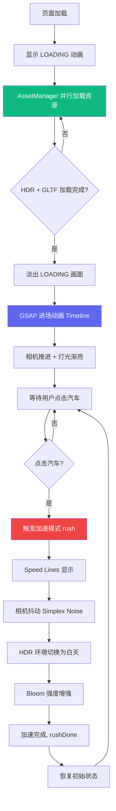

# 项目实战二：汽车展示网站（完整复刻版）

> 完整复刻小米 SU7 官网特效，参考 [su7-replica](https://github.com/alphardex/su7-replica)

## 在线演示

<iframe
  src="/blog/three-projects/car-showcase/index.html"
  width="100%"
  height="560px"
  frameborder="0"
  style="border-radius:8px; background:#000;"
  allow="autoplay; xr-spatial-tracking"
  allowfullscreen
></iframe>

<p style="text-align:center; color:rgba(255,255,255,0.4); font-size:12px; margin-top:8px;">
  🚗 等待 LOADING 动画完成 → 进场 → 点击汽车触发加速 &nbsp;|&nbsp; Speed Lines · 相机抖动 · HDR 环境 · Bloom 发光
</p>

## 项目概述

本项目完整复刻了小米 SU7 官网的 3D 展示特效，包含以下功能：

| 功能 | 实现方式 |
|------|---------|
| LOADING 动画 | CSS 动画 + JS 过渡 |
| 进场动画 | GSAP timeline 编排 |
| 点击加速 | 射线检测 + GSAP 时间线 |
| Speed Lines | GLTF 模型 |
| 相机抖动 | Simplex Noise 算法 |
| HDR 环境切换 | 两个 HDR 动态混合 |
| Bloom 发光 | UnrealBloomPass 后处理 |
| 地面反射 | 自定义 GLSL 着色器 |
| 背景音乐 | Howler.js |

## 制作阶段

本项目分为 **11 个阶段**，每个阶段独立成篇：

| 阶段 | 名称 | 内容 |
|------|------|------|
| Stage 1 | 项目初始化与结构\|Stage1-项目初始化 | 目录结构、依赖安装、Vite 配置 |
| Stage 2 | 入口页面与加载动画\|Stage2-入口页面与加载动画 | HTML 结构、CSS 动画原理 |
| Stage 3 | Three.js 基础场景\|Stage3-ThreeJS基础场景 | 场景、相机、渲染器、坐标系统 |
| Stage 4 | 资源加载系统\|Stage4-资源加载系统 | AssetManager、HDR、纹理预处理 |
| Stage 5 | 后处理 Bloom 发光\|Stage5-后处理Bloom发光 | EffectComposer、Bloom 原理、emissive 材质 |
| Stage 6 | 动态环境贴图\|Stage6-动态环境贴图 | FBO、两个 HDR 混合、着色器 |
| Stage 7 | 汽车与展示厅模型\|Stage7-汽车与展示厅模型 | GLTF 加载、材质配置、贴图详解 |
| Stage 8 | GSAP 动画系统\|Stage8-GSAP动画系统 | Timeline、缓动函数、进场动画 |
| Stage 9 | 加速模式\|Stage9-加速模式 | rush/rushDone、完整时间线 |
| Stage 10 | 相机抖动\|Stage10-相机抖动 | Simplex Noise、Lerp 平滑 |
| Stage 11 | 交互与完整流程\|Stage11-交互与完整流程 | 射线检测、背景音乐、初始化流程 |

## 项目架构




## 项目结构

重构后的项目采用 TypeScript 模块化架构，`src/` 目录结构如下：

```

car-showcase/
├── index.html              # 入口 HTML（LOADING 动画 CSS）
├── package.json           # 依赖
├── tsconfig.json          # TypeScript 配置
├── vite.config.ts         # Vite 配置（glsl 插件支持）
├── public/                # 外部资源（构建时自动复制到 dist/）
│   ├── audio/bgm.mp3     # 背景音乐
│   ├── mesh/
│   │   ├── sm_car.gltf         # 汽车 GLTF 模型
│   │   ├── sm_startroom.raw.gltf  # 展示厅模型
│   │   └── sm_speedup.gltf       # Speed Lines 模型
│   └── texture/
│       ├── t_env_night.hdr      # 夜间 HDR 环境贴图
│       ├── t_env_light.hdr       # 白天 HDR 环境贴图
│       ├── t_car_body_AO.jpg    # 车身 AO 贴图
│       └── t_floor_*.webp       # 地面法线/粗糙度贴图
└── src/
    ├── main.ts              # 程序入口
    ├── style.css            # 全局样式
    ├── Experience/          # 核心体验层（架构核心）
    │   ├── Experience.ts    # 主体验类，统筹所有子系统
    │   ├── Debug.ts         # lil-gui 调试面板
    │   ├── Postprocessing.ts # 后处理管线（Bloom 等）
    │   ├── resources.ts     # 资源清单定义
    │   ├── Shaders/         # 自定义 GLSL 着色器
    │   │   ├── DynamicEnv/  # 动态环境贴图着色器
    │   │   ├── ReflecFloor/ # 地面反射着色器
    │   │   └── Speedup/     # 速度线特效着色器
    │   ├── Utils/           # 工具类
    │   │   └── meshReflectorMaterial.ts  # 网格反射材质
    │   └── World/           # 世界中的实体对象
    │       ├── World.ts     # 世界容器，管理所有实体
    │       ├── Car.ts       # 汽车模型加载与配置
    │       ├── StartRoom.ts  # 展示厅模型
    │       ├── Speedup.ts   # 速度线特效控制
    │       ├── DynamicEnv.ts # 动态环境贴图控制
    │       ├── CameraShake.ts # 相机抖动
    │       └── Furina.ts    # 芙宁插件（待用）
```


### 架构设计思路

```

main.ts
  └── Experience（主体验类）
        ├── Debug（调试面板）
        ├── Postprocessing（后处理）
        ├── World（世界容器）
        │     ├── Car（汽车）
        │     ├── StartRoom（展示厅）
        │     ├── Speedup（速度线）
        │     ├── DynamicEnv（动态环境）
        │     └── CameraShake（相机抖动）
        └── resources（资源清单）
```


采用这种分层设计的好处：
- **Experience** 是所有效果的协调者，不直接操作 3D 对象
- **World** 负责具体 3D 对象的创建和更新
- **Shaders** 目录管理所有自定义 GLSL 代码，便于维护
- 调试面板可以实时修改任何参数而无需重启

## 技术栈

| 技术 | 版本 | 用途 |
|------|------|------|
| Three.js | ^0.162.0 | 3D 渲染引擎 |
| TypeScript | ^5.4.3 | 类型安全开发 |
| GSAP | ^3.14 | 动画时间线编排 |
| kokomi.js | ^1.9.99 | Three.js 工具库 |
| postprocessing | ^6.35 | 后处理效果 |
| lygia | ^1.1.3 | 着色器工具库 |
| simplex-noise | ^4.0 | 平滑随机噪声 |
| howler.js | ^2.2 | 背景音乐播放 |
| lil-gui | ^0.19 | 参数调试面板 |
| vite-plugin-glsl | ^1.5 | GLSL 着色器导入 |

## 特效功能详解

### 🚀 LOADING 动画
纯 CSS 驱动的逐字跳动动画，JS 监听 `AssetManager` 加载进度，到 100% 后添加 `hollow` 类淡出。

### 🎬 进场动画
GSAP `timeline()` 编排：相机推进 + 灯光渐亮 + 环境贴图强度变化，全部完成后解锁交互。

### ⚡ 点击加速
射线检测点击 → `rush()` 函数触发 → GSAP timeline 并行控制 Speed Lines / 相机抖动 / HDR 切换 / Bloom 增强。

### 🎨 HDR 动态混合
两个 HDR 通过权重 `envWeight` 插值混合（0=夜间，1=白天），由 GSAP timeline 驱动过渡。

### ✨ Bloom 发光
`postprocessing` 库的 `UnrealBloomEffect`，emissive 材质亮度超过 threshold 即产生光晕。

### 📷 相机抖动
`simplex-noise` 生成平滑连续的随机值，每帧叠加到相机位置，避免纯随机造成的画面撕裂。

### 🪞 地面反射
自定义 GLSL 着色器 `meshReflectorMaterial` 实现镜面反射效果，模拟汽车展厅地面的光泽感。

## 运行项目

```bash
# 安装依赖
pnpm install

# 开发模式（热重载）
pnpm dev

# 生产构建
pnpm build
```


## 下载项目

> ⚠️ 汽车展示项目含外部资源（GLTF/HDR/音频），部署时需将 dist 下的所有文件一起部署

<a href="/blog/three-projects/car-showcase/index.html" target="_blank">📄 在线预览汽车展示</a>

<a href="/blog/three-projects/car-showcase.zip" download>📦 下载完整项目源码</a>

## 扩展练习

### 练习 1：添加轨道控制器
加速完成后解锁 OrbitControls：

```ts
import { OrbitControls } from 'three/examples/jsm/controls/OrbitControls.js'
const controls = new OrbitControls(camera, renderer.domElement)
controls.enableDamping = true
```


### 练习 2：参数 HUD 面板
用 lil-gui 实时调节 Bloom 强度、相机抖动幅度等参数。

### 练习 3：加速音效
使用 Howler.js 在 rush 触发时播放引擎轰鸣音效。

---

